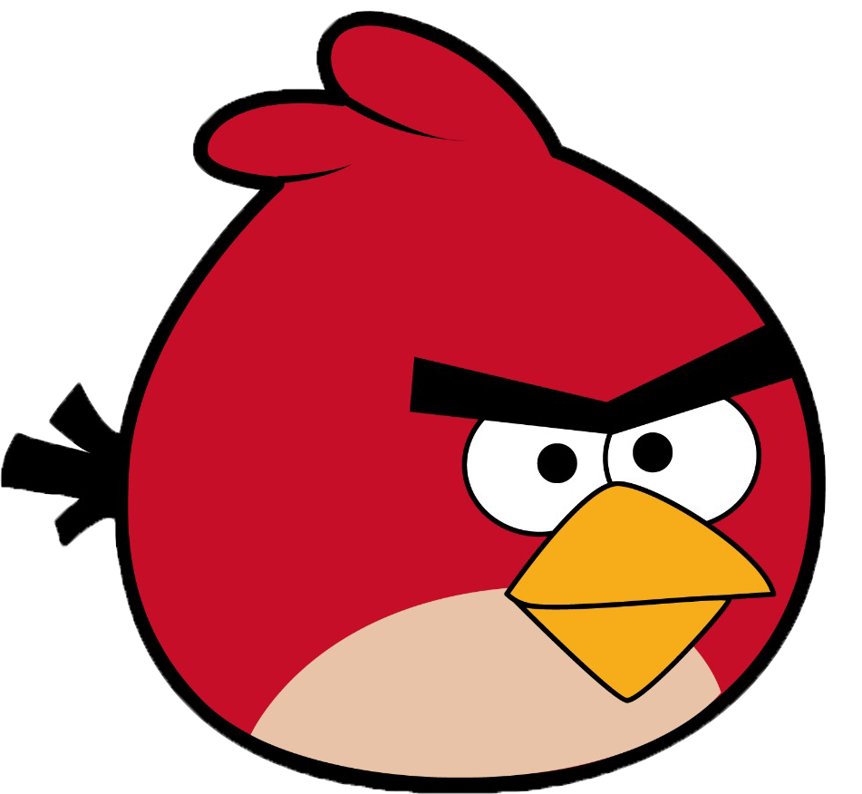
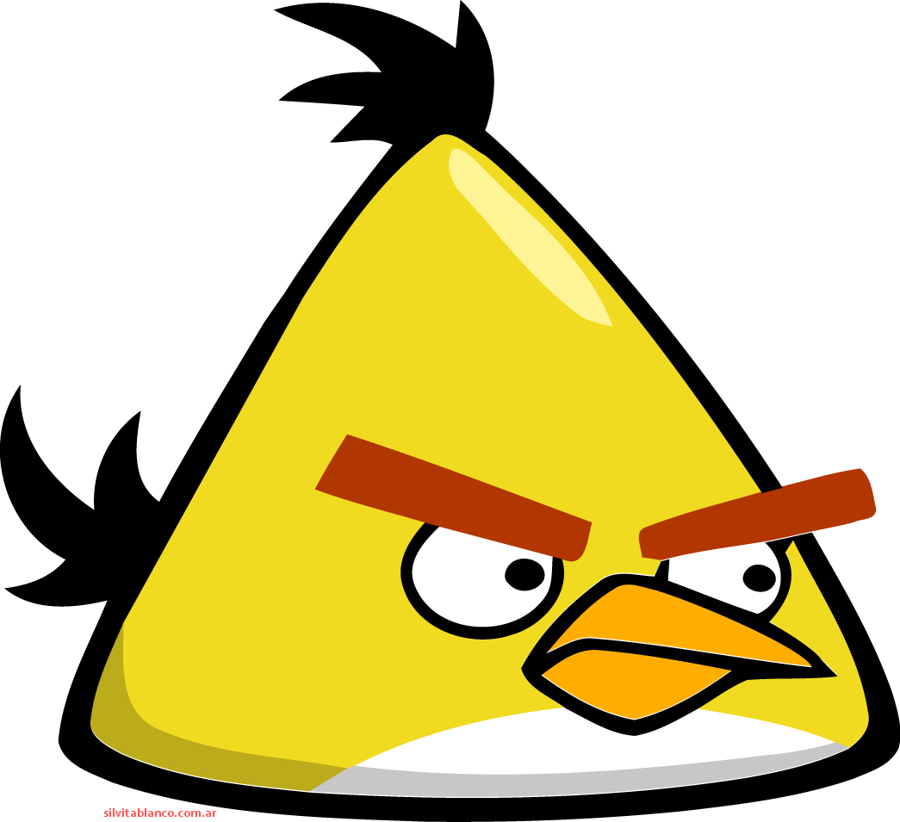
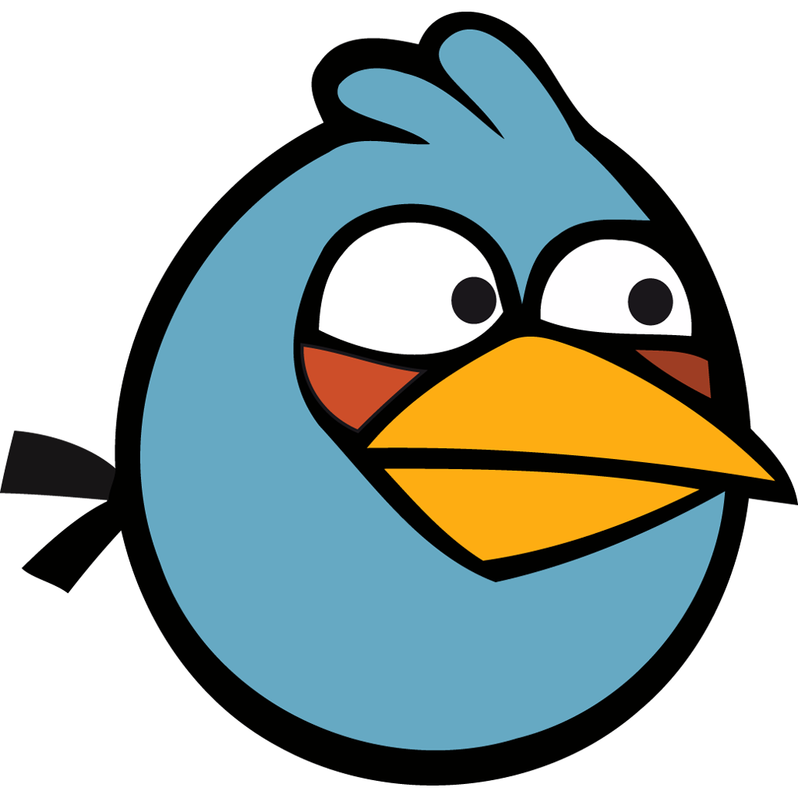
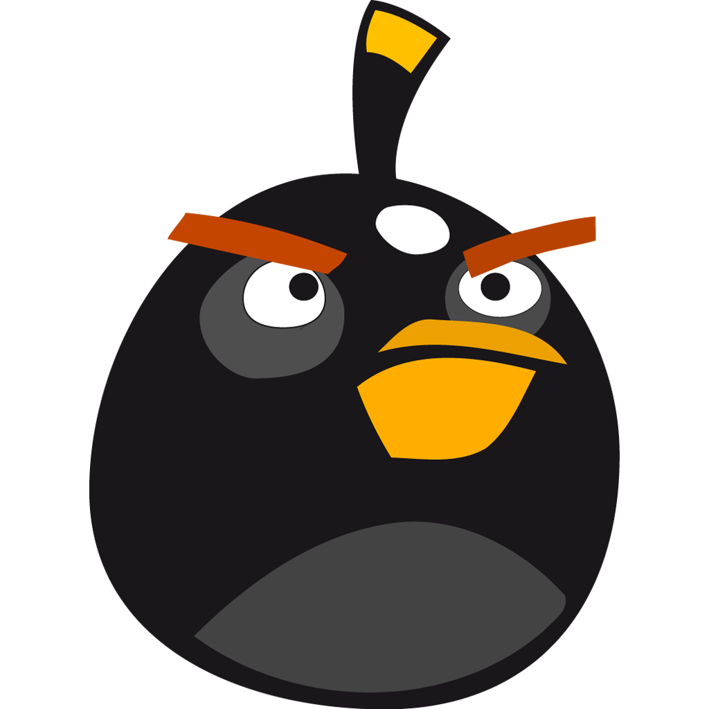

# Angry-Birds-using-Pygame
## Tamanna Kumari
### CS-104-Priject Spring 2024-25
A CS104 Project where we use the Pygame-ce Module in Python to design an angry Bird's game.

## Table Of Contents


## Pre-Requisites

* Python 3.12.3 installation
* On certain Linux and mac systems 'python' still points to default python 2 as the default python. Use 'python3' instead for the first command to point to python3.


### Setting Up Venv

Setting up a virtual environment to run this project

```
python -m venv venv
source venv/bin/activate
python -m pip install -r requirements.txt

```
## Introduction
This is a two-player Angry Birds Showdown. First one to destroy all of the opponent's blocks wins. All the birds have their own unique special ability and induce variable damage based on their type, speed etc.

## About the Birds

#### **Right mouse click to activate Special abilities**

### RED



    Red does equal damage to all the blocks for a given speed.

    Special Ability : It can transform into giant red which is very very powerful and does maximum damage possible. 
    Usage : It's special ability can be only used once per player.




    Chuck does more damage to wood blocks and less damage to others for a given speed.

    Special Ability : Super Speed
    It attains really high speed which increases it's damage.
    Usage : Unlimited. A player can use it's special ability everytime.



    Blue does more damage to ice blocks and less damage to others for the same speed.

    Special Ability : Triplify
    It can multiply into 3 and triple it's attack area and increase damage.
    Usage : Unlimited. A player can use it's special ability everytime.



    Bomb does more damage to stone blocks and less damage to others for the same speed.
    Special Ability : Bomb
    It can burst upon collision and induce heavy damage on all the blocks. 
    Usage : It's usage is a gamble. Both players combined can use this ability a total of n times where n is a randomly generated number in the range of 0 to 5. So it may happen that neither player gets to use this ability in a match. Moreover you must time your usage of this ability as the number of times you can use it also depends upon your opponent.


